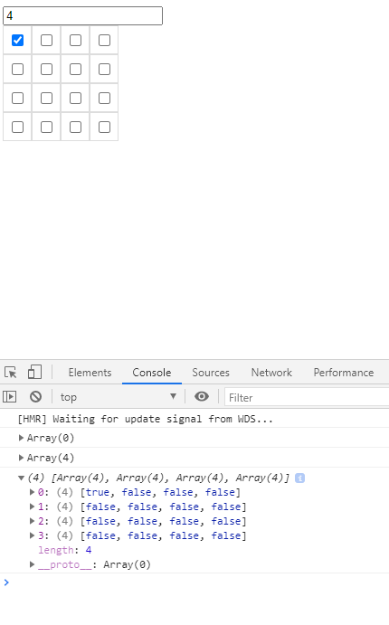

# About

## Description

This demo illustrates an small example using ReactJs to show a grid of checkboxes.\
The checkboxes will be rendered to a 2-dimensional array (column number euqal to row one) which's column number would be inputted by user.

## Details

- User inputs a valid number to create a default grid (column number = row one) of `false` checkboxes
- After checking specific checkbox, the console will print current grid's values following a 2-dimentional array, for example, if user check the first checkbox in the first row: `[[true, false] [false, false]]`
- Image for example:\

# Commands and References

This demo was bootstrapped with [Create React App](https://github.com/facebook/create-react-app).\
Please run `yarn` to install necessary libs before executing demo's commands.

## Available Scripts

In the demo directory, you can run:

### `yarn start`

Runs the app in the development mode with link [http://localhost:3000](http://localhost:3000).

The page will reload if you make edits.\
You will also see any lint errors in the console.

### `yarn build`

Builds the app for production to the `build` folder.\
It correctly bundles React in production mode and optimizes the build for the best performance.

See the section about [deployment](https://facebook.github.io/create-react-app/docs/deployment) for more information.

## Learn More

You can learn more in the [Create React App documentation](https://facebook.github.io/create-react-app/docs/getting-started).\
To learn React, check out the [React documentation](https://reactjs.org/).

### Code Splitting

This section has moved here: [https://facebook.github.io/create-react-app/docs/code-splitting](https://facebook.github.io/create-react-app/docs/code-splitting)

### Analyzing the Bundle Size

This section has moved here: [https://facebook.github.io/create-react-app/docs/analyzing-the-bundle-size](https://facebook.github.io/create-react-app/docs/analyzing-the-bundle-size)

### Making a Progressive Web App

This section has moved here: [https://facebook.github.io/create-react-app/docs/making-a-progressive-web-app](https://facebook.github.io/create-react-app/docs/making-a-progressive-web-app)

### Advanced Configuration

This section has moved here: [https://facebook.github.io/create-react-app/docs/advanced-configuration](https://facebook.github.io/create-react-app/docs/advanced-configuration)

### Deployment

This section has moved here: [https://facebook.github.io/create-react-app/docs/deployment](https://facebook.github.io/create-react-app/docs/deployment)

### `yarn build` fails to minify

This section has moved here: [https://facebook.github.io/create-react-app/docs/troubleshooting#npm-run-build-fails-to-minify](https://facebook.github.io/create-react-app/docs/troubleshooting#npm-run-build-fails-to-minify)
